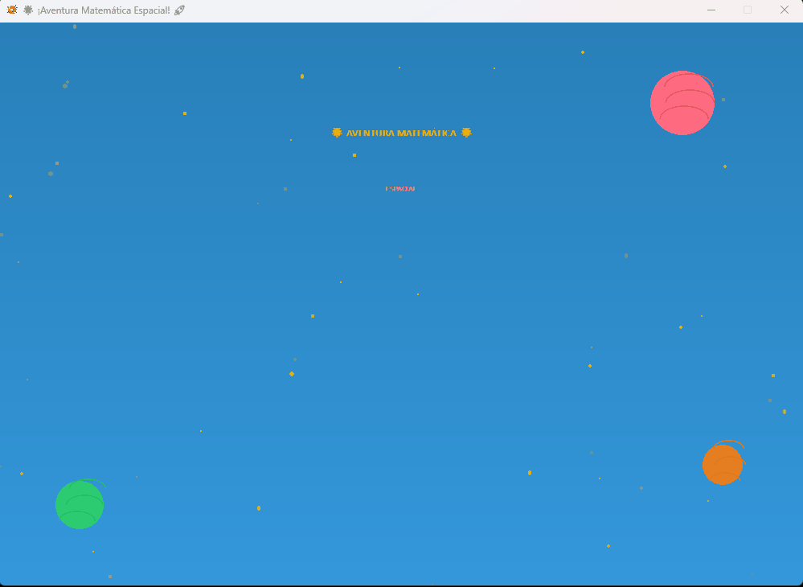

[](README.es.md)

# 🚀 EduMath - Educational Math Game


An exciting educational math game with a captivating space theme, designed for elementary school students. Travel through the cosmos solving math problems, earning stars, and becoming a master math astronaut!

---

## 🎬 Preview

<div align="center">
  
</div>

---

## 👨‍🎓 Developer Info

- **Developer:** Carlos Gabriel Magallanes López
- **Email:** cgmagallanes23@gmail.com
- **Last Updated:** December 16, 2025

---

## 🎮 What is EduMath?

EduMath transforms math practice into an exciting space exploration adventure. Designed for students in grades 1 through 6, the game adapts its difficulty to each student's level, making math practice fun and engaging.

### 🌟 Why this game?
- **Adaptive Learning:** Each grade has carefully calibrated difficulty
- **Immediate Feedback:** Learn from mistakes instantly with visual and audio cues
- **Motivational Design:** Earn stars and achievements to track your progress
- **Attractive Theme:** Beautiful space environment with animated characters
- **Educational Focus:** Reinforces essential math skills through repetition and practice

---

## 🎯 How to Play

### Getting Started
1. **Launch the game** — Double-click the executable file
2. **Watch the intro** — Enjoy the animated welcome screen
3. **Press ENTER** — Advance to the grade selection menu
4. **Choose your grade** — Click your school grade (1st to 6th)
5. **Start solving** — Answer 10 math questions suited to your level

### Game Controls

| Control | Action |
|---------|--------|
| **Mouse Click** | Select grade buttons and navigate menus |
| **Number Keys (0-9)** | Enter your answer (numpad also works) |
| **Minus Key (-)** | Enter negative numbers |
| **Backspace** | Delete the last digit |
| **Enter** | Submit your answer or continue |
| **ESC** | Exit the game at any time |

### Understanding the Interface

#### During the Game
- **Top Left:** Your current grade
- **Top Center:** Question progress (e.g. "Question 3/10")
- **Progress Bar:** Visual representation of your advancement
- **Top Right:** Stars earned this session (⭐)
- **Center:** The math problem to solve
- **Input Field:** Where you type your answer (with blinking cursor)
- **Bottom:** Feedback messages and instructions

#### Results Screen
- **Mission Status:** Your astronaut rank based on your performance
- **Star Display:** Visual representation of correct answers
- **Statistics:** Detailed breakdown of your performance
- **Total Stars:** Accumulated stars across all sessions

---

## 📊 Grade Levels & Difficulty

The game adapts to six different levels, each with appropriate challenges:

### 🎓 1st Grade (Ages 6–7)
**Operations:** Addition (+), Subtraction (-)  
**Number Range:** 1–20  
**Example:** `8 + 5 = ???` or `12 - 4 = ???`  
**Focus:** Basic number sense and single-digit operations

### 🎓 2nd Grade (Ages 7–8)
**Operations:** Addition (+), Subtraction (-)  
**Number Range:** 10–50  
**Example:** `27 + 18 = ???` or `35 - 12 = ???`  
**Focus:** Two-digit operations and mental math

### 🎓 3rd Grade (Ages 8–9)
**Operations:** Addition (+), Subtraction (-), Multiplication (×)  
**Number Range:** 10–60  
**Example:** `7 × 8 = ???` or `45 - 17 = ???`  
**Focus:** Introduction to multiplication tables

### 🎓 4th Grade (Ages 9–10)
**Operations:** Addition (+), Subtraction (-), Multiplication (×), Division (÷)  
**Number Range:** 20–100  
**Example:** `48 ÷ 6 = ???` or `12 × 7 = ???`  
**Focus:** All four basic operations

### 🎓 5th Grade (Ages 10–11)
**Operations:** All four operations  
**Number Range:** 100–500  
**Example:** `384 + 127 = ???` or `144 ÷ 12 = ???`  
**Focus:** Larger numbers and mental calculation strategies

### 🎓 6th Grade (Ages 11–12)
**Operations:** All four operations  
**Number Range:** 500–1500  
**Example:** `875 - 392 = ???` or `25 × 48 = ???`  
**Focus:** Advanced calculations and numerical fluency

---

## 🏆 Scoring & Achievements

### Star System
- **⭐ 1 star** for each correct answer
- **10 stars** maximum per session
- **Cumulative tracking** across all game sessions

### Astronaut Ranks

| Score | Rank | Message |
|-------|------|---------|
| 90–100% | 🚀 **Expert Astronaut** | "EXPERT ASTRONAUT!" |
| 70–89% | 🌟 **Space Explorer** | "SPACE EXPLORER!" |
| 50–69% | ⭐ **Cadet in Training** | "CADET IN TRAINING!" |
| 0–49% | 💪 **Keep Practicing** | "KEEP PRACTICING!" |

### What Happens When You Answer?

#### ✅ Correct Answer
- **Visual feedback:** Green "EXCELLENT!" message with particle burst
- **Audio:** Cheerful success sound
- **Robot emotion:** Excited and happy
- **Reward:** +1 star added to your total
- **Next:** Automatic advance to the next question

#### ❌ Wrong Answer
- **Visual feedback:** Red message showing the correct answer
- **Audio:** Soft error sound (not annoying)
- **Robot emotion:** Sad but encouraging
- **Learning:** See the correct answer to understand
- **Next:** Advance to next question after reviewing

---

## 🎨 Game Features

### Visual Elements
- **Animated background:** Twinkling stars and spinning planets
- **Particle effects:** Colorful celebrations on correct answers
- **Gradient interface:** Beautiful color transitions throughout
- **Smooth animations:** Professional-level movement and transitions
- **Flying rockets:** Decorative spacecraft on transitions

### Audio Experience
- **Background music:** Relaxing space-themed soundtrack (continuous loop)
- **Success sound:** Rewarding chime for correct answers
- **Error sound:** Soft notification for mistakes
- **Volume:** Balanced for comfortable gameplay

### Character Interactions
**Guide Robot** — Your friendly companion throughout the game
- **Happy:** Default state, cheering you on
- **Excited:** Celebrates your correct answers
- **Sad:** Shows empathy when you make mistakes

---

## 🎮 Game Flow

```
GAME START
    ↓
INTRO SCREEN (Animated title)
    ↓
PRESS ENTER
    ↓
GRADE SELECTION MENU (Choose 1st to 6th)
    ↓
CLICK YOUR GRADE
    ↓
GAME LOOP (10 questions)
    ↓
    • Question is displayed
    • Type your answer
    • Press ENTER
    • Receive feedback
    • See next question
    ↓
RESULTS SCREEN
    ↓
    • See your rank
    • Check statistics
    • Review total stars
    • Click "BACK TO MAIN MENU"
    ↓
RETURN TO GRADE SELECTION
```

---

## 💡 Tips for Parents & Teachers

### Maximizing Learning
- **Regular practice:** Short 10-minute daily sessions are more effective than long ones
- **Right grade:** Always select the correct level for appropriate difficulty
- **Review mistakes:** When the game shows the correct answer, discuss it with the student
- **Celebrate progress:** Use the star system to track improvement over time
- **No pressure:** The game is designed to be encouraging, not stressful

### Educational Benefits
✅ **Mental math skills:** Quick calculation practice  
✅ **Number sense:** Understanding relationships between numbers  
✅ **Operation fluency:** Mastery of +, -, ×, ÷  
✅ **Error learning:** Immediate correction and explanation  
✅ **Progress tracking:** Visual motivation through stars and ranks  
✅ **Self-paced:** Students control their own learning speed  

---

## 📥 Installation & System Requirements

### Running the Game
1. Download the executable (.exe) from [Releases](https://github.com/TheNarratorVIMMXX/EduMath/releases)
2. Double-click to launch
3. No installation required — runs directly

### System Requirements

| Component | Requirement |
|-----------|-------------|
| **OS** | Windows 10 / 11 |
| **RAM** | 2 GB minimum |
| **Display** | 1000×700 minimum resolution |
| **Audio** | Speakers or headphones recommended |
| **Storage** | ~30 MB free space |

### Troubleshooting
- **Won't start?** Right-click → Run as administrator
- **No sound?** Check volume mixer and system audio
- **Blurry screen?** Make sure resolution is at least 1000×700
- **Crashes unexpectedly?** Restart and try again; contact the developer if it persists

---

## 🌐 Language Note

The game interface is currently in **Spanish**. Math operations are universal, but feedback messages and instructions appear in Spanish.

---

## 🔮 Coming Soon

Future updates may include:
- Multi-language support (English, French, etc.)
- Difficulty customization within each grade
- Timed challenge mode
- Two-player competition mode
- Extended question sets (20, 50 questions)
- Sound on/off toggle
- Save and load progress between sessions
- Printable progress reports

---

## 📞 Support & Feedback

**Developer:** Carlos Gabriel Magallanes López  
**Email:** cgmagallanes23@gmail.com

Found a bug? Have a suggestion? Want to share your high score? Feel free to reach out!

---

## 📜 License & Credits

**License:** Proprietary — Strictly for personal and educational use  
**Copyright:** © 2025 Carlos Gabriel Magallanes López — All rights reserved

⚠️ **Important:** This software is proprietary. You may download and use the executable for personal or educational purposes only. Redistribution, modification, reverse engineering, or commercial use are strictly prohibited without written authorization.

For licensing or commercial inquiries: cgmagallanes23@gmail.com

**Credits:** Developed with the Python Arcade library  
**Purpose:** Math education for elementary school students

📋 See the [LICENSE](LICENSE) file for full terms and conditions.

---

### 🌟 Download EduMath and start your journey to becoming a master math astronaut! 🚀

**Ideal for:**
- Elementary school students (Grades 1–6)
- Homeschooling parents
- Classroom teachers
- Math tutors
- After-school programs

**Turn math into an adventure!** ⭐
